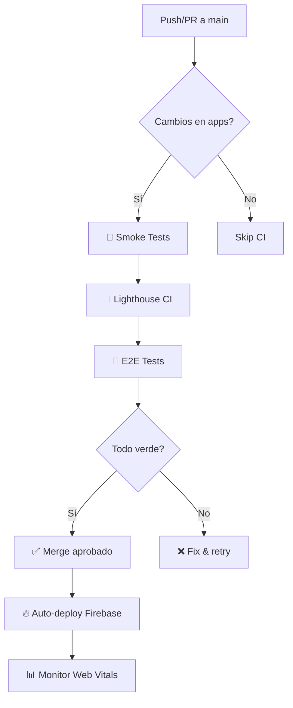

# 🚀 GUÍA DE DEPLOYMENT - FORESTECH

> **📋 LECTURA OBLIGATORIA PARA TODO EL EQUIPO**  
> Esta guía define el flujo oficial de deployment para el proyecto Forestech.

## 🏗️ **ARQUITECTURA DUAL**

Forestech maneja **2 sistemas de deployment separados**:

### **1. 🔥 Firebase (Frontend + Hosting)**
- **Apps**: Combustibles + Alimentación  
- **Sites**: 
  - `combustibles-subdomain` → https://combustibles.forestechdecolombia.com.co
  - `forestechdecolombia` → https://forestechdecolombia.web.app (alimentación)
- **Funciones**: Solo SSR + redirectors
- **Triggers**: Push a main + Manual

### **2. ☁️ Cloud Run (Backend SQL)**
- **Servicios**: SQL endpoints + DigitalOcean SQL Server
- **URL**: https://forestech-sql-service-851382130132.us-central1.run.app
- **Funciones**: 60+ endpoints SQL, webhooks, face recognition
- **Triggers**: Solo manual (requiere permisos)

---

## 🎯 **WORKFLOWS ACTIVOS (Solo 3)**

### **🔥 Deploy to Firebase** 
**Archivo**: `.github/workflows/release-deploy.yml`

**Cuándo se ejecuta**:
- ✅ **AUTO**: Push a `main` (cambios en apps)
- ✅ **MANUAL**: GitHub Actions → "🚀 Deploy to Firebase" → Run workflow

**Opciones manuales**:
- `all` - Deploy ambas apps
- `combustibles` - Solo app combustibles  
- `alimentacion` - Solo app alimentación

**Duración**: ~3-5 minutos

---

### **☁️ Deploy to Cloud Run**
**Archivo**: `.github/workflows/deploy-cloud-run.yml`

**Cuándo se ejecuta**:
- ✅ **MANUAL ÚNICAMENTE**: GitHub Actions → "🚀 Deploy to Cloud Run"
- ⚠️ **Requiere**: `force_deploy: true` + permisos adicionales

**Requisitos de permisos**:
```bash
# Ejecutar solo si quieres activar auto-deploy Cloud Run
gcloud projects add-iam-policy-binding liquidacionapp-62962 \
  --member="serviceAccount:github-action-1002035008@liquidacionapp-62962.iam.gserviceaccount.com" \
  --role="roles/run.admin"

gcloud projects add-iam-policy-binding liquidacionapp-62962 \
  --member="serviceAccount:github-action-1002035008@liquidacionapp-62962.iam.gserviceaccount.com" \
  --role="roles/storage.admin"
```

**Duración**: ~2-3 minutos

---

### **🧪 E2E Tests**
**Archivo**: `.github/workflows/combustibles-e2e.yml`

**Cuándo se ejecuta**:
- ✅ **AUTO**: Push a `main` (cambios en combustibles)
- ✅ **MANUAL**: GitHub Actions → "Combustibles E2E Tests"

**Duración**: ~5-8 minutos

---

## 📋 **FLUJO DE DESARROLLO**

### **Para cambios de Frontend (React)**
```bash
# 1. Desarrollar localmente
npm run dev:combustibles  # puerto 5174
npm run dev:alimentacion  # puerto 5173

# 2. Commit & Push
git add .
git commit -m "feat: nueva funcionalidad"
git push origin main

# 3. ✅ AUTO-DEPLOY: Firebase se despliega automáticamente
```

### **Para cambios de Backend (SQL/Cloud Run)**
```bash
# 1. Desarrollar localmente 
cd functions
npm run dev

# 2. Commit & Push (sin auto-deploy)
git add .
git commit -m "feat: nueva API endpoint"
git push origin main

# 3. 🔴 MANUAL DEPLOY: Ve a GitHub Actions
# → "🚀 Deploy to Cloud Run" → Run workflow → force_deploy: true
```

### **Para deployment completo**
```bash
# 1. Commit todos los cambios
git push origin main

# 2. MANUAL: Ve a GitHub Actions
# → "🚀 Deploy to Firebase" → Run workflow → all
# → "🚀 Deploy to Cloud Run" → Run workflow → force_deploy: true
```

---

## 🌐 **URLs DE PRODUCCIÓN**

| Servicio | URL | Propósito |
|----------|-----|-----------|
| **Combustibles** | https://combustibles.forestechdecolombia.com.co | App principal combustibles |
| **Alimentación** | https://forestechdecolombia.web.app/alimentacion | App alimentación |
| **API SQL** | https://forestech-sql-service-851382130132.us-central1.run.app | Backend SQL + Azure |
| **Firebase** | https://combustibles-subdomain.web.app | Backup combustibles |

---

## ⚡ **DEPLOYMENTS RÁPIDOS**

### **Solo cambié frontend:**
1. **Push a main** → ✅ Auto-deploy Firebase
2. **Verificar**: https://combustibles.forestechdecolombia.com.co

### **Solo cambié backend:**
1. **Push a main** (no deploy automático)
2. **GitHub Actions** → "🚀 Deploy to Cloud Run" → `force_deploy: true`
3. **Verificar**: https://forestech-sql-service-851382130132.us-central1.run.app/health

### **Cambié ambos:**
1. **Push a main** → ✅ Auto-deploy Firebase
2. **GitHub Actions** → "🚀 Deploy to Cloud Run" → `force_deploy: true`

---

## 🚨 **TROUBLESHOOTING**

### **Firebase deployment falla**
```bash
# 1. Verificar build local
npm run build:all

# 2. Deploy manual
firebase deploy --only hosting --project liquidacionapp-62962
```

### **Cloud Run deployment falla**
- ✅ **Verificar permisos**: Service account necesita `roles/storage.admin`
- ✅ **Verificar código**: Dockerfile y cloud-run-server.js
- ✅ **Health check**: curl URL/health

### **E2E tests fallan**
- ✅ **Local**: `npm run test:e2e --workspace=combustibles`
- ✅ **Env vars**: Verificar secrets en GitHub

---

## 👥 **RESPONSABILIDADES**

### **Frontend Developers**
- ✅ Push changes → Auto-deploy Firebase
- ✅ Verificar URLs de producción
- ✅ Revisar E2E test results

### **Backend Developers** 
- ✅ Push changes → Manual deploy Cloud Run
- ✅ Verificar health endpoints
- ✅ Monitor Cloud Run logs

### **DevOps/Leads**
- ✅ Gestionar permisos GitHub Actions
- ✅ Monitor workflows y costos
- ✅ Actualizar esta guía cuando sea necesario

---

## � **CI/CD & QUALITY GATES**

### **🔦 Lighthouse CI** (Sprint 4, Día 4)
**Workflow**: `.github/workflows/lighthouse-ci.yml`

**Cuándo se ejecuta**:
- ✅ **AUTO**: En cada PR a `main`
- ✅ **MANUAL**: GitHub Actions → "🔦 Lighthouse CI"

**Budgets & Thresholds**:
| Categoría | Threshold | Desktop | Mobile |
|-----------|-----------|---------|--------|
| 🚀 Performance | ≥90 | ✅ | ✅ |
| ♿ Accessibility | ≥90 | ✅ | ✅ |
| 🏆 Best Practices | ≥90 | ✅ | ✅ |
| 🔍 SEO | ≥90 | ✅ | ✅ |

**Métricas monitoreadas**:
- **FCP** (First Contentful Paint): <2s desktop, <3s mobile
- **LCP** (Largest Contentful Paint): <2.5s desktop, <4s mobile
- **TBT** (Total Blocking Time): <300ms desktop, <600ms mobile
- **CLS** (Cumulative Layout Shift): <0.1

**Archivos de configuración**:
- `lighthouserc-desktop.json` - Config para pruebas desktop
- `lighthouserc-mobile.json` - Config para pruebas mobile

**Reportes**:
- Se suben como artifacts en GitHub Actions
- Retención: 30 días
- Ver en: Actions → Workflow run → Artifacts

---

### **🧪 Smoke Tests**
**Workflow**: `.github/workflows/ci-smoke-tests.yml`

**Jobs incluidos**:
1. **Lint & Test** (~5 min)
   - ESLint en combustibles y alimentación
   - Unit tests (cuando estén configurados)
   
2. **Build Validation** (~10 min)
   - Build de ambas apps
   - Análisis de bundle sizes
   - Artifacts de build disponibles

3. **Performance Budget** (~8 min)
   - Validación contra `performance-budget.json`
   - Falla si bundles exceden límites
   - Ver script: `scripts/performance-budget-check.sh`

**Performance Budget** (`performance-budget.json`):
```json
{
  "combustibles": {
    "total": "350kb (max)",
    "App.jsx": "12kb (max)",
    "MovementWizard.jsx": "8kb (max)",
    "vendor": "250kb (max)"
  }
}
```

**Mejoras desde baseline** (Sprint 4):
- Bundle total: -31% (506kb → 350kb)
- App.jsx: -68% (37.5kb → 12kb)
- MovementWizard: -84% (50kb → 8kb)

---

### **📊 Firebase Performance Monitoring**

**Setup activo desde**: Sprint 4, Día 4  
**Dashboard**: [Firebase Console](https://console.firebase.google.com/project/liquidacionapp-62962/performance)

**Web Vitals recolectados**:
| Métrica | Good | Needs Improvement | Poor |
|---------|------|-------------------|------|
| **LCP** | ≤2.5s | 2.5s-4.0s | >4.0s |
| **FID** | ≤100ms | 100ms-300ms | >300ms |
| **CLS** | ≤0.1 | 0.1-0.25 | >0.25 |
| **FCP** | ≤1.8s | 1.8s-3.0s | >3.0s |
| **TTFB** | ≤800ms | 800ms-1800ms | >1800ms |

**Implementación**:
- Archivo: `combustibles/src/firebase/performanceMonitoring.js`
- Auto-inicializa en `main.jsx`
- Envía métricas a Firebase Performance
- Ver documentación: `docs/FIREBASE_PERFORMANCE_MONITORING.md`

**Acceso a datos**:
1. Firebase Console → Performance
2. Filtrar por versión, dispositivo, región
3. Alertas configurables para degradaciones

---

### **✅ Pre-Deployment Checklist**

Antes de hacer merge a `main`:

- [ ] ✅ **Lint pasa**: `npm run lint:all`
- [ ] ✅ **Build exitoso**: `npm run build:all`
- [ ] ✅ **E2E tests pasan**: Workflow verde en PR
- [ ] ✅ **Lighthouse CI**: Todos los scores ≥90
- [ ] ✅ **Performance budget**: Sin excesos de tamaño
- [ ] ✅ **Smoke tests**: Workflow verde
- [ ] ✅ **Review aprobado**: Al menos 1 approval

**Post-Deployment**:
- [ ] ✅ **URLs funcionan**: Verificar producción
- [ ] ✅ **Logs limpios**: Sin errores en consola
- [ ] ✅ **Web Vitals**: Revisar Firebase Performance (24h)
- [ ] ✅ **User testing**: Flujos críticos funcionan

---

### **🎯 Flujo CI/CD Completo**



**Tiempos totales**:
- **PR Checks**: ~15-20 minutos
- **Deploy Firebase**: ~3-5 minutos
- **Deploy Cloud Run**: ~2-3 minutos (manual)
- **Total (Frontend)**: ~20-25 minutos
- **Total (Backend)**: +3 minutos

---

## �📞 **CONTACTO URGENTE**

Si un deployment falla en producción:
1. **Slack**: #forestech-deploy
2. **GitHub Issues**: Crear issue con label `deployment`
3. **Rollback**: Usar commit anterior + manual deploy

---

> **🔔 Esta guía se actualiza cada que cambia el flujo de deployment**  
> **📅 Última actualización**: Octubre 2025 (Sprint 4, Día 4 - CI/CD)  
> **📝 Responsable**: DevOps Team