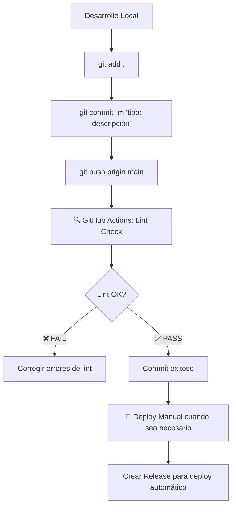

# 🌲 Forestech Colombia - Sistema de Gestión Forestal

> **🚀 [📋 GUÍA DE DEPLOYMENT - LECTURA OBLIGATORIA](./DEPLOYMENT_GUIDE.md)**

Monorepo de aplicaciones web para operaciones forestales en Colombia. Firebase + Cloud Run + Azure SQL.

## 🤖 **PARA AGENTES DE IA (GitHub Copilot, Claude, ChatGPT)**

### **📋 Información Crítica de Deployment**
- **Frontend**: Auto-deploy con `git push origin main`
- **Backend**: Manual deploy via GitHub Actions únicamente
- **Solo 3 workflows activos** (ignorar archivos .disabled)
- **Arquitectura dual**: Firebase (frontend) + Cloud Run (backend)

### **📁 Archivos de Configuración para IA**
- **`.ai`** - Instrucciones generales para todos los agentes
- **`.github/copilot-instructions.md`** - Instrucciones específicas GitHub Copilot  
- **`.chatgpt`** - Instrucciones específicas ChatGPT
- **`.claude/instructions.md`** - Instrucciones específicas Claude

### **🚨 Reglas Críticas para IA**
- ❌ NO sugerir workflows desactivados (.yml.disabled)
- ❌ NO usar `npm run deploy` (deprecated)
- ❌ NO crear funciones SQL en Firebase Functions
- ✅ Revisar DEPLOYMENT_GUIDE.md para procedimientos
- ✅ Distinguir entre Firebase (frontend) y Cloud Run (backend)

---

## 🏗️ **ARQUITECTURA**

- **🔥 Firebase**: Apps React (Combustibles + Alimentación) + SSR
- **☁️ Cloud Run**: Backend SQL + Azure Database + Webhooks
- **🧪 E2E**: Tests automatizados con Playwright

## ⚡ **INICIO RÁPIDO**

```bash
# Instalar dependencias
npm install

# Desarrollo local
npm run dev:combustibles  # puerto 5174
npm run dev:alimentacion  # puerto 5173

# Build producción
npm run build:all
```

## 🚀 **DEPLOYMENT**

### **Frontend (Auto-deploy)**
```bash
git push origin main  # ✅ Auto-deploy Firebase
```

### **Backend (Manual)**
```bash
# 1. Push código
git push origin main

# 2. GitHub Actions → "🚀 Deploy to Cloud Run" → force_deploy: true
```

**📋 [Ver guía completa de deployment](./DEPLOYMENT_GUIDE.md)**

## 🌐 **URLs Producción**

- **Combustibles**: https://combustibles.forestechdecolombia.com.co
- **Alimentación**: https://forestechdecolombia.web.app/alimentacion  
- **API Backend**: https://forestech-sql-service-851382130132.us-central1.run.app

## 🛠️ **Tecnologías**

- **Frontend**: React 19 + Vite + Tailwind CSS + React Aria
- **Backend**: Node.js + Express + Azure SQL
- **Auth**: Firebase Auth + WebAuthn (passkeys)
- **Deploy**: Firebase Hosting + Cloud Run
- **Testing**: Playwright E2E

---

**📖 Documentación completa en [DEPLOYMENT_GUIDE.md](./DEPLOYMENT_GUIDE.md)**

## 📋 Flujo de Trabajo Optimizado

### 🎯 Nuevo Flujo (Septiembre 2025)



### 📝 1. Desarrollo y Commit (Lint Automático)

Cuando haces commit, **solo se ejecuta validación de código**:

```bash
# Desarrollo normal
git add .
git commit -m "feat: nueva funcionalidad"
git push origin main
```

**✅ Lo que sucede automáticamente:**
- 🔍 **ESLint** en ambas aplicaciones
- 🚫 **Bloquea el commit** si hay errores de lint
- 📊 **Reporta resultados** en GitHub Actions

### 🚀 2. Deploy Manual (Solo cuando lo decidas)

El deploy ya **NO es automático** en cada commit. Para hacer deploy:

#### Opción A: Deploy Manual desde GitHub
1. Ve a **Actions** → **🚀 Forestech Manual Deploy TURBO**
2. Click **"Run workflow"**
3. Selecciona qué app desplegar:
   - `all` - Ambas aplicaciones
   - `combustibles` - Solo Combustibles
   - `alimentacion` - Solo Alimentación

#### Opción B: Deploy desde terminal local
```bash
# Deploy completo
npm run deploy

# Deploy rápido (solo cambios)
npm run deploy:fast

# Deploy con medición de performance
npm run deploy:measure
```

### 🏷️ 3. Deploy Automático en Releases

Para **deploy automático a producción**, crea un release:

```bash
# Crear tag y release
git tag v1.2.3
git push origin v1.2.3

# O desde GitHub: Releases → "Create a new release"
```

**✅ Deploy automático cuando:**
- Creas un **release** en GitHub
- Haces push de un **tag** que empiece con `v` (ej: `v1.0.0`)

## 🛠️ Comandos de Desarrollo

### Desarrollo Local
```bash
# Iniciar desarrollo
npm run dev:combustibles  # Puerto 5174
npm run dev:alimentacion  # Puerto 5173

# Build local
npm run build:all
npm run build:combustibles
npm run build:alimentacion
```

### Validación de Código
```bash
# Lint completo
npm run lint:all

# Lint por aplicación
npm run lint:combustibles
npm run lint:alimentacion

# Auto-fix lint issues
npm run lint:fix  # En cada app
```

### Deploy
```bash
# Deploy manual completo
npm run deploy

# Deploy forzado (ignora cache)
npm run deploy:force

# Deploy rápido
npm run deploy:fast

# Limpiar cache y rebuild
npm run clean:build
```

## 📊 Estados de los Workflows

| Workflow | Trigger | Acción | Estado |
|----------|---------|--------|--------|
| 🔍 Lint & Code Quality | Push/PR | Valida ESLint | ✅ Automático |
| 🚀 Manual Deploy TURBO | Manual | Deploy selectivo | ✅ Manual |
| 🚀 Release Deploy | Release/Tag | Deploy producción | ✅ Automático |

## 🎯 Beneficios del Nuevo Flujo

### ✅ Ventajas
- **🚫 Menos ruido**: No deploy automático en cada commit
- **🔍 Calidad garantizada**: Lint siempre se ejecuta
- **🎯 Control total**: Deploy solo cuando lo decides
- **🏷️ Releases limpios**: Deploy automático solo en versiones oficiales
- **⚡ Más rápido**: Commits más rápidos sin deploy

### 📈 Mejoras de Performance
- **Tiempo de commit**: ~30s (solo lint) vs ~8min (build + deploy)
- **Control de costos**: Deploy solo cuando es necesario
- **Mejor feedback**: Errores de lint inmediatos

## 🚨 Solución de Problemas

### Lint Errors
```bash
# Ver errores específicos
npm run lint:combustibles
npm run lint:alimentacion

# Auto-fix donde sea posible
cd combustibles && npm run lint:fix
cd ../alimentacion && npm run lint:fix
```

### Deploy Issues
```bash
# Limpiar cache y retry
npm run clean
npm run deploy:force

# Ver logs de Firebase
firebase hosting:channel:list
```

### Workflow Failures
- Revisa **Actions** tab en GitHub
- Verifica **secrets** están configurados
- Confirma **branch protection rules**

## 📚 Documentación Adicional

- [Guía de Desarrollo](./docs/)
- [Configuración Firebase](./docs/firebase-setup.md)
- [WebAuthn Setup](./combustibles/PASSKEY_IMPLEMENTATION.md)
- [Performance Budget](./scripts/performance-budget-check.sh)

---

**Última actualización**: Septiembre 2025
**Versión del flujo**: 2.0 - Lint First, Deploy Manual

---

## 🧪 Test Commit - Flujo Optimizado
> Commit de prueba realizado el 13 de septiembre de 2025 para validar el nuevo workflow de lint automático.
