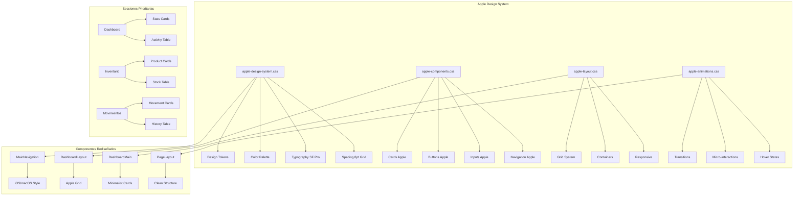
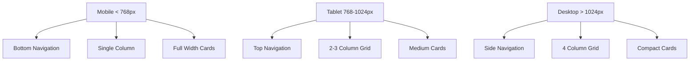

# Arquitectura del Rediseño Apple - Combustibles App

## 🏗️ Diagrama de Arquitectura



## 🎨 Flujo de Implementación


## 📱 Responsive Strategy



## 🔄 Comparación: Antes vs Después

### Antes (SAP Fiori)
- **Colores**: Teal, Verdigris, Nyanza (coloridos)
- **Tipografía**: Open Sans, 72 SAP
- **Navegación**: Tabs horizontales con iconos
- **Cards**: Bordes definidos, colores corporativos
- **Espaciado**: Variable, no sistemático

### Después (Apple Style)
- **Colores**: Grises neutros, azul sistema
- **Tipografía**: SF Pro (Inter fallback)
- **Navegación**: iOS/macOS style, minimalista
- **Cards**: Sombras sutiles, bordes redondeados
- **Espaciado**: 8pt grid sistemático

## 🎯 Componentes Clave a Rediseñar

### 1. MainNavigation
```
Actual: Tabs horizontales con iconos y subtítulos
Apple:  Navegación limpia, estados sutiles, blur background
```

### 2. Dashboard Cards
```
Actual: Cards coloridas con gradientes
Apple:  Cards blancas, sombras sutiles, tipografía clara
```

### 3. Tables
```
Actual: Bordes definidos, colores SAP
Apple:  Líneas sutiles, espaciado generoso, hover suave
```

### 4. Buttons
```
Actual: Gradientes, múltiples variantes
Apple:  Sólidos, estados claros, border-radius consistente
```

## 📊 Métricas de Éxito

### Performance
- [ ] Tiempo de carga < 2s
- [ ] Smooth animations 60fps
- [ ] Responsive en todos los breakpoints

### UX
- [ ] Navegación intuitiva
- [ ] Jerarquía visual clara
- [ ] Accesibilidad WCAG 2.1 AA

### Visual
- [ ] Consistencia Apple
- [ ] Paleta neutra aplicada
- [ ] Tipografía SF Pro implementada

## 🚀 Plan de Rollout

### Fase 1: Fundación (Semana 1)
- [x] Documentación sistema Apple
- [-] Design tokens implementados
- [ ] Componentes base creados

### Fase 2: Navegación (Semana 1-2)
- [ ] MainNavigation rediseñada
- [ ] DashboardLayout actualizado
- [ ] Estados y transiciones

### Fase 3: Dashboard (Semana 2)
- [ ] Cards rediseñadas
- [ ] Tablas actualizadas
- [ ] Responsive implementado

### Fase 4: Secciones (Semana 2-3)
- [ ] Inventario rediseñado
- [ ] Movimientos rediseñado
- [ ] Componentes compartidos

### Fase 5: Optimización (Semana 3)
- [ ] Performance tuning
- [ ] Testing cross-browser
- [ ] Ajustes finales

## 🔧 Herramientas y Tecnologías

### Existentes (Mantener)
- React 19.1.0
- Vite
- CSS Variables
- Tailwind CSS

### Nuevas (Agregar)
- Inter font (SF Pro fallback)
- Apple design tokens
- Nuevos componentes CSS

### Modificar
- Sistema de colores actual
- Componentes de navegación
- Layout del dashboard
- Estilos de cards y tablas

---

## 📋 Checklist de Implementación

### Design Tokens ✅
- [x] Documentación completa
- [ ] Variables CSS creadas
- [ ] Importación configurada
- [ ] Tokens aplicados

### Componentes Base
- [ ] Cards Apple style
- [ ] Buttons Apple style
- [ ] Inputs Apple style
- [ ] Navigation Apple style

### Layout
- [ ] Grid system Apple
- [ ] Containers responsive
- [ ] Spacing sistemático

### Navegación
- [ ] MainNavigation rediseñada
- [ ] Estados activos/hover
- [ ] Responsive behavior

### Dashboard
- [ ] Layout minimalista
- [ ] Cards rediseñadas
- [ ] Tablas actualizadas

### Secciones
- [ ] Inventario Apple style
- [ ] Movimientos Apple style
- [ ] Componentes compartidos

---

Esta arquitectura garantiza un rediseño sistemático y coherente, manteniendo la funcionalidad existente mientras se transforma completamente la experiencia visual hacia el estilo Apple.