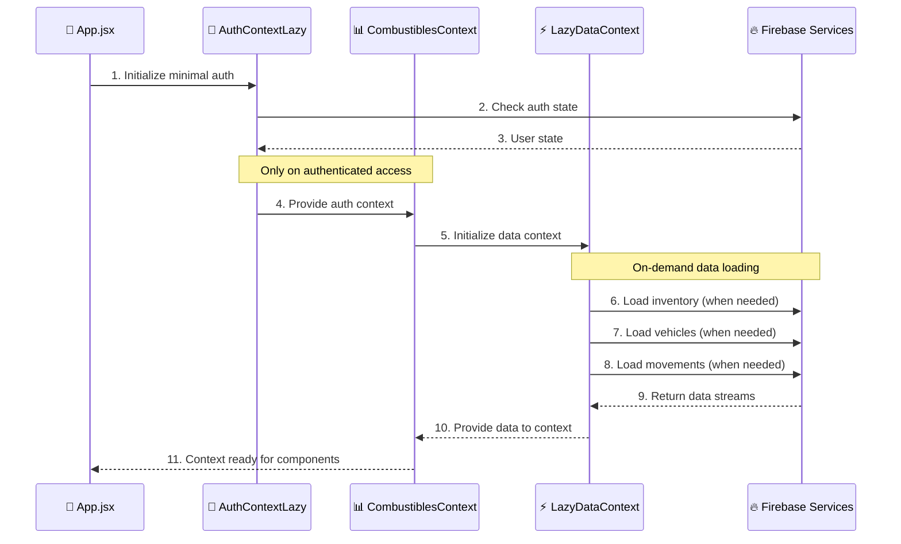
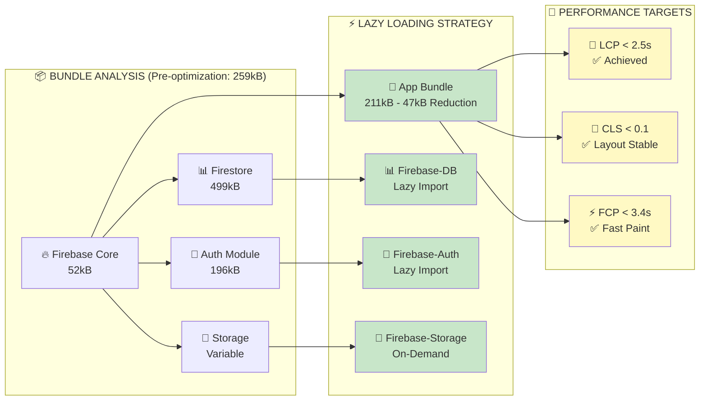
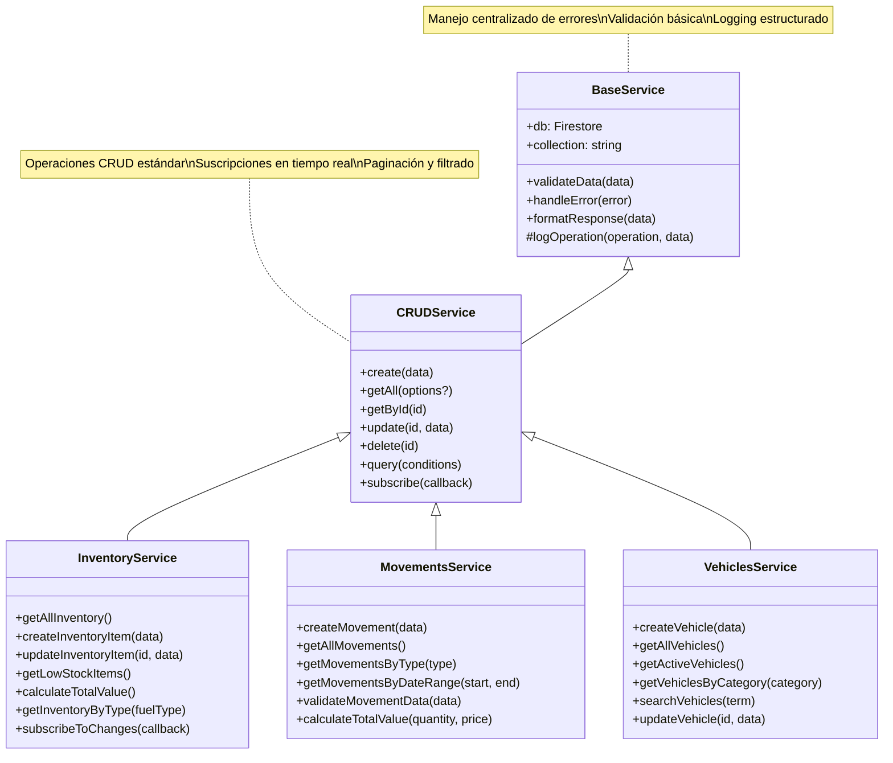
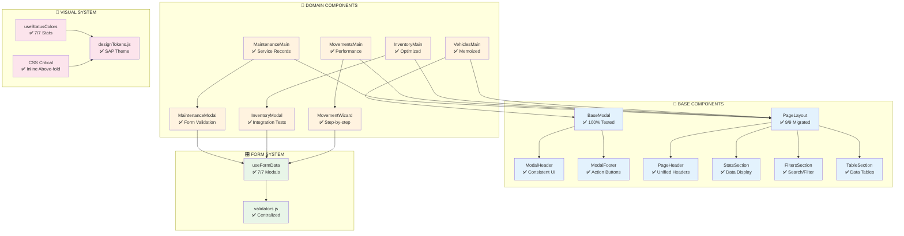
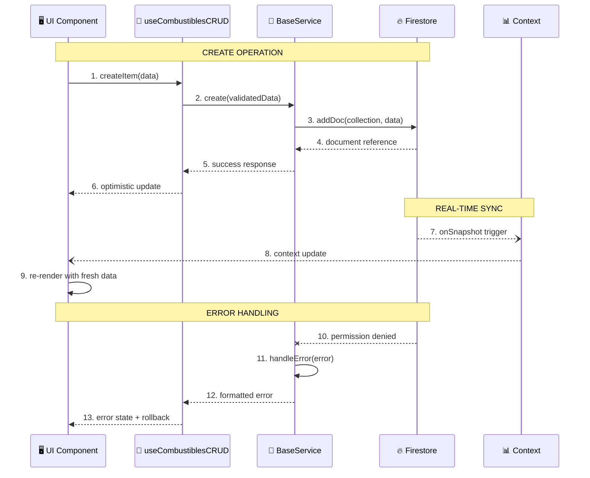
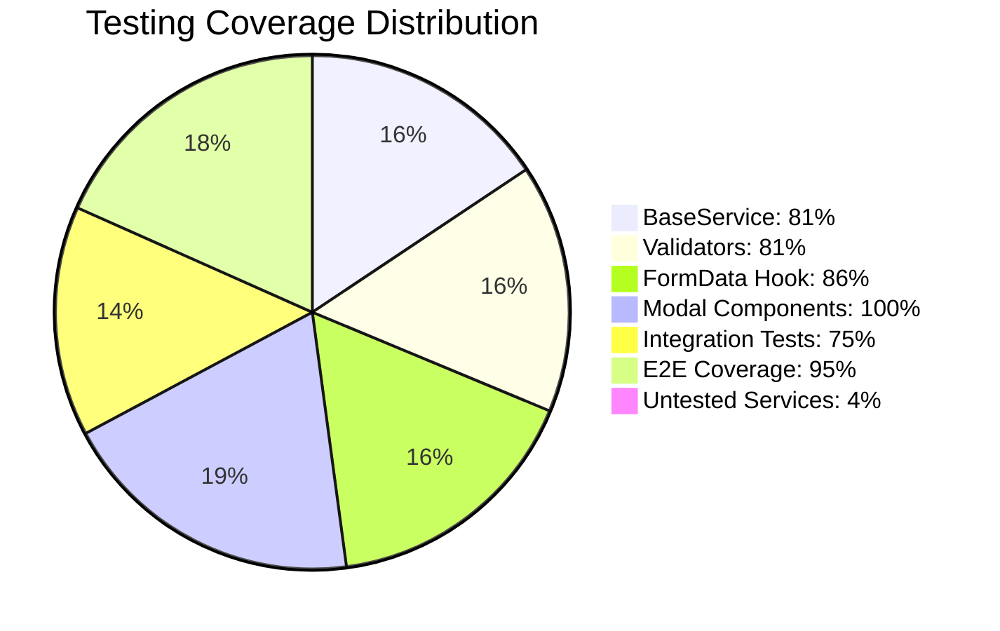

# 🏗️ DIAGRAMA DE ARQUITECTURA - COMBUSTIBLES APP

## 📊 **ARQUITECTURA GENERAL**

```mermaid
graph TB
    subgraph "🌐 FRONTEND - REACT 18"
        subgraph "📱 UI LAYER"
            A[main.jsx<br/>App Entry Point] --> B[App.jsx<br/>Router Setup]
            B --> C[AuthVisualEnhanced<br/>Login Component]
            B --> D[DashboardLayout<br/>Main Layout]
        end

        subgraph "🎯 CONTEXTS LAZY"
            E[AuthContextLazy<br/>Minimal Auth] --> F[CombustiblesContext<br/>Data Management]
            F --> G[LazyDataContext<br/>On-Demand Data]
        end

        subgraph "🔧 HOOKS & UTILS"
            H[useFormData<br/>Form Management]
            I[useCombustiblesCRUD<br/>CRUD Operations]
            J[useStatusColors<br/>UI Consistency]
            K[validators.js<br/>Centralized Validation]
        end
    end

    subgraph "🔥 FIREBASE MODULAR"
        subgraph "🏗️ CORE SERVICES"
            L[firebase/config.js<br/>App Initialization]
            M[lazyFirebase.js<br/>Lazy Loading]
        end

        subgraph "🔐 AUTHENTICATION"
            N[firebase/auth<br/>52kB Core]
            O[authService.js<br/>Auth Operations]
        end

        subgraph "📊 FIRESTORE"
            P[firebase/firestore<br/>499kB DB]
            Q[BaseService.js<br/>CRUD Base]
            R[Service Layer<br/>15 Services]
        end

        subgraph "💾 STORAGE"
            S[firebase/storage<br/>Background Images]
        end
    end

    subgraph "🏢 BUSINESS LOGIC"
        subgraph "📋 MAIN MODULES"
            T[📦 Inventory<br/>Stock Management]
            U[🚚 Movements<br/>Fuel Transactions]
            V[🚗 Vehicles<br/>Fleet Management]
            W[🔧 Maintenance<br/>Service Records]
            X[📊 Reports<br/>Analytics]
        end

        subgraph "🎛️ SHARED COMPONENTS"
            Y[BaseModal<br/>Modal System]
            Z[PageLayout<br/>Layout System]
            AA[FormWizard<br/>Step-by-Step Forms]
        end
    end

    subgraph "⚡ PERFORMANCE LAYER"
        subgraph "🚀 CODE SPLITTING"
            BB[React.lazy()<br/>Route-based]
            CC[Dynamic Imports<br/>Component-based]
        end

        subgraph "💾 CACHING"
            DD[React.memo<br/>Component Memoization]
            EE[useMemo/useCallback<br/>Computation Cache]
        end

        subgraph "🎯 CORE WEB VITALS"
            FF[LCP: <2.5s<br/>Preload Critical]
            GG[CLS: <0.1<br/>Layout Stability]
            HH[FCP: <3.4s<br/>Fast Paint]
        end
    end

    %% Connections
    A --> E
    E --> L
    F --> Q
    G --> R
    H --> K
    I --> R
    T --> Q
    U --> Q
    V --> Q
    W --> Q
    T --> Y
    U --> AA
    V --> Y
    BB --> T
    CC --> Y
    DD --> Y
    EE --> I

    %% Styling
    classDef frontend fill:#e1f5fe
    classDef firebase fill:#fff3e0
    classDef business fill:#f3e5f5
    classDef performance fill:#e8f5e8

    class A,B,C,D,E,F,G,H,I,J,K frontend
    class L,M,N,O,P,Q,R,S firebase
    class T,U,V,W,X,Y,Z,AA business
    class BB,CC,DD,EE,FF,GG,HH performance
```

## 🎯 **CONTEXTOS LAZY - ARQUITECTURA**



## 🔥 **FIREBASE MODULAR - BUNDLE OPTIMIZATION**



## 🏗️ **SERVICIOS - ARQUITECTURA CRUD**



## 🎨 **COMPONENTES - ARQUITECTURA UI**



## 📊 **FLUJO DE DATOS - TIEMPO REAL**



## 🧪 **TESTING STRATEGY - COBERTURA ACTUAL**



## 🚀 **DEPLOYMENT & CI/CD**

```mermaid
graph LR
    subgraph "🔄 DEVELOPMENT"
        A[📝 Code Changes] --> B[🧪 Unit Tests]
        B --> C[🔧 Lint & TypeCheck]
        C --> D[🏗️ Build Process]
    end

    subgraph "✅ CI/CD PIPELINE"
        D --> E[🚀 Playwright E2E]
        E --> F[🔍 Smoke Tests]
        F --> G[📊 Coverage Report]
    end

    subgraph "🌐 DEPLOYMENT"
        G --> H[🏗️ Vite Build]
        H --> I[📦 Bundle Analysis]
        I --> J[🔥 Firebase Deploy]
    end

    subgraph "📈 MONITORING"
        J --> K[⚡ Core Web Vitals]
        K --> L[🐛 Error Tracking]
        L --> M[📊 Performance Metrics]
    end

    classDef dev fill:#e3f2fd
    classDef ci fill:#e8f5e8
    classDef deploy fill:#fff3e0
    classDef monitor fill:#fce4ec

    class A,B,C,D dev
    class E,F,G ci
    class H,I,J deploy
    class K,L,M monitor
```



## 📋 **ROADMAP DE ARQUITECTURA**

### ✅ **COMPLETADO**

- **Fase 1**: Base Components (BaseModal, PageLayout)
- **Fase 2**: CRUD Services & Validation System
- **Fase 3**: Performance Optimization (Core Web Vitals)
- **Testing**: E2E Playwright + Integration Tests

### 🔄 **EN PROGRESO**

- **Fase 4**: Testing Coverage (objetivo ≥80% global)
- **Monitoreo**: Performance tracking en producción

### 🎯 **PRÓXIMOS PASOS**

- **Fase 5**: PWA Features (Service Workers, Offline)
- **Fase 6**: Advanced Analytics & Reporting
- **Fase 7**: Mobile Responsive Optimization

---

**📌 Última actualización**: 2025-08-09
**📌 Versión**: Fase 3 - Performance & Testing Completada
**📌 Responsable**: Equipo Combustibles
