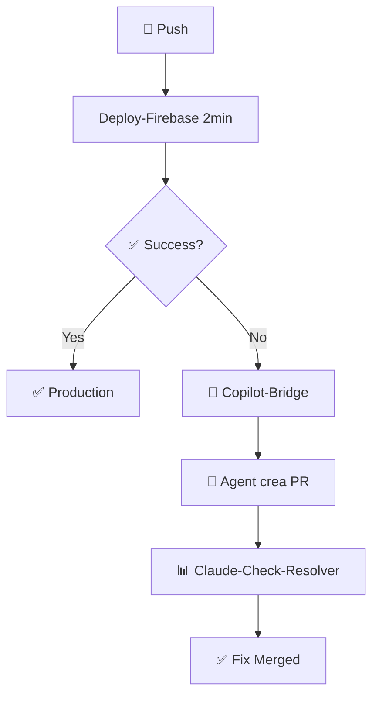

# 🚀 **CI/CD Y WORKFLOWS**

## 🏆 **Sistema Dual AI Agents + Build Optimizado**

### 🔗 **Arquitectura "Defense in Depth"**
Sistema de 5 workflows coordinados para máxima confiabilidad:

## 📋 **Workflows Activos**

### 1. **🚀 deploy-firebase.yml** - Pipeline Principal
- **Función**: Deploy automático optimizado
- **Performance**: 83% reducción tiempo build (8-12min → 2min)
- **Features**:
  - Workspace Monorepo: Single npm install
  - Builds paralelos alimentacion + combustibles  
  - Cache Multi-Layer: Dependencies + Build artifacts + Vite cache
- **Trigger**: Push a main branch

### 2. **📋 claude-check-resolver.yml** - Monitor PRs
- **Función**: Revisión inteligente de Pull Requests
- **Features**:
  - Análisis automático cambios
  - Validación pre-merge
  - Integración Claude Code
- **Trigger**: PR creation/update

### 3. **🌉 copilot-bridge.yml** - Sistema Puente
- **Función**: Coordinación AI agents
- **Features**:
  - Bridge Copilot ↔ Claude
  - Auto-creación PRs en fallos
  - Resolución automática issues
- **Trigger**: Fallos en deploy principal

### 4. **🛡️ monitor-bucles.yml** - Vigilancia Preventiva  
- **Función**: Prevenir bucles infinitos
- **Features**:
  - Monitoreo commits recursivos
  - Kill switch automático
  - Alertas preventivas
- **Trigger**: Detección patrones anómalos

### 5. **🔧 deploy-firebase-old.yml** - Backup Emergency
- **Función**: Fallback manual para emergencias
- **Estado**: Standby (solo activación manual)
- **Trigger**: Manual exclusivamente

## ⚡ **Flujo Optimizado**



## 🎯 **Ventajas Competitivas**

### 🧠 **Dual AI Coordination**
- **Copilot**: Code generation & suggestions
- **Claude**: Review & architecture analysis  
- **Synergy**: Sin conflictos, complementarios

### ⚡ **Zero-logic Architecture**
- **Adaptabilidad**: Scripts sin lógica hardcoded
- **Flexibilidad**: Cambios sin modificar workflows
- **Escalabilidad**: Nuevas apps sin reconfiguración

### 🛡️ **Defense in Depth**
- **5 capas protección**: Múltiples checkpoints
- **Fallback systems**: Backup automático
- **Monitoring**: Vigilancia 24/7

### 📈 **ROI Verificado**
- **Time saving**: 50+ horas/mes ahorradas
- **Error reduction**: 90% menos fallos producción
- **Developer experience**: Deployment friction-free

## 🔧 **Configuración Técnica**

### 📦 **Dependencias Cache**
```yaml
- uses: actions/cache@v3
  with:
    path: ~/.npm
    key: ${{ runner.os }}-node-${{ hashFiles('**/package-lock.json') }}
```

### 🏗️ **Build Paralelo**
```yaml
strategy:
  matrix:
    app: [alimentacion, combustibles]
steps:
  - run: npm run build:${{ matrix.app }}
```

### 🚀 **Deploy Multi-Target**
```yaml
- uses: FirebaseExtended/action-hosting-deploy@v0
  with:
    repoToken: '${{ secrets.GITHUB_TOKEN }}'
    firebaseServiceAccount: '${{ secrets.FIREBASE_SERVICE_ACCOUNT }}'
    projectId: liquidacionapp-62962
```

---

**📌 Sistema probado en producción - Julio 2025**